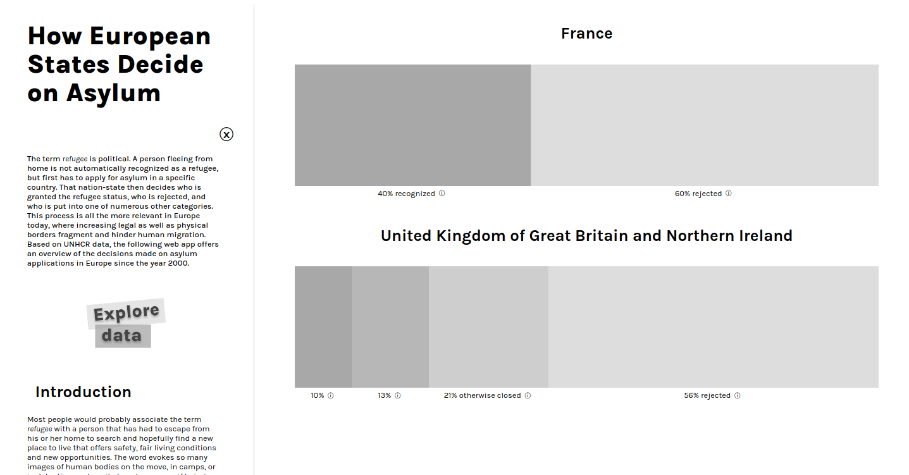

# How European States Decide on Asylum

Visit the live verson of the site at [mappingmigration.erictapen.name](https://mappingmigration.erictapen.name/).

You can also find the source code at [https://github.com/erictapen/mapping-migration/](https://github.com/erictapen/mappingmigration/releases/tag/abgabe).

For browsing the local build, you have to employ some sort of webserver, as our application rewrites URLs, which isn't compatible with just opening the html in the browser as a `file://` type of URL.

Also please note that it is possible that this site performs badly in Safari. We noticed these issues when we were too deep into the development process already, were we couldn't retract from the choice of language anymore.

